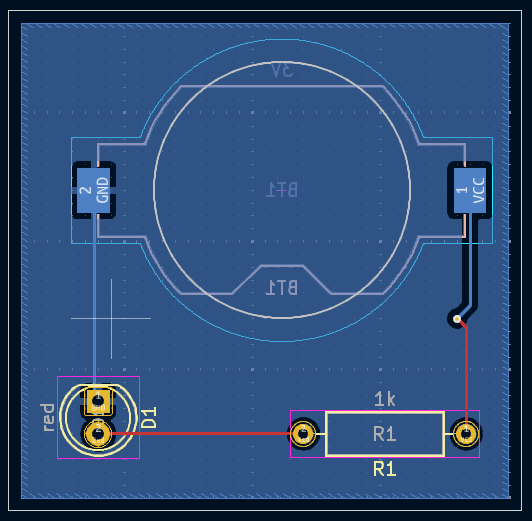
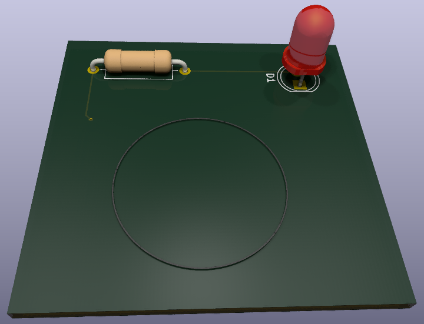

# 🛠️ KiCad Design Workflow: Schematic ↔ PCB

This guide explains the complete workflow in **KiCad**, placing the **Schematic Editor** and **PCB Editor** side by side — as if you're reading a double-page layout. Use it as a reference during the full design process.

| 📘 **Schematic Editor** | 🧩 **PCB Editor** |
|------------------------|------------------|
| 🔧 The schematic is a **symbolic representation** of your circuit. It shows all components (via symbols) and their logical connections.   It's created first and defines the logic of your design. | 🔧 The PCB is the **physical realization** of your schematic. It places the **footprints** of components and routes copper tracks between them. |
| 🧰 The Schematic Editor is a **separate window** in KiCad where components are placed and connected. It follows an **integrated workflow** with the PCB. Changes sync both ways. | 🧰 The PCB Editor is another dedicated window. It reads the schematic’s connectivity and helps lay out components on a real board while enforcing rules and manufacturability. |
| 🚀 **Start here**:  1. Create a new project 2. Open Schematic Editor 3. Configure the symbol libraries if prompted | 🚀 **Then open**:  1. PCB Editor via Project Manager 2. It auto-loads the `.kicad_pcb` file 3. Go to `File → Board Setup…` to define layers, rules, and net classes |
| 🧭 Navigation: - Pan: middle/right mouse - Zoom: scroll wheel / `F1`, `F2` - Toolbars (left = view, right = tools) - Hotkeys: `'A'` to add, `'W'` to wire, `'L'` to label | 🧭 Navigation: - Same pan/zoom as schematic - Left toolbar: display settings - Right toolbar: routing tools - Appearance Panel: change active layer, color, visibility - Selection Filter: manage object types |
| 🧩 Add symbols via `'A'` - Search in libraries - Use filter box - Choose from 'Device' for basics | 📐 After importing from schematic (`F8`): - Draw board outline in `Edge.Cuts` layer - Use rectangle, arc, line, bezier tools - Make sure the outline is a **closed, clean shape** |
| ✏️ Select and move: - Click, Shift+click - `'M'` to move, `'G'` to drag - `'R'` to rotate, `'Del'` to delete | 📌 Place and orient footprints: - `'M'` to move, `'R'` to rotate, `'F'` to flip side (mirrored) - Follow mechanical & electrical layout constraints - Use ratsnest for placement guidance |
| 🔌 Wiring: - Use `'W'` to draw wires - Click pin-to-pin or hover-start - Power: `'P'`, Net labels: `'L'` - Auto-connects nets with same name | 🔗 Routing: - Select active layer (e.g., `F.Cu`) - Use `'X'` to route tracks - `'V'` inserts via to switch layers - Pads support multi-layer connections |
| 🔠 Annotate: - Assign reference designators - Fill values - Auto or manual  🧩 Assign footprints: - Use Footprint Assignment tool - Filters: pin count, type, library | 🧱 Board Setup: - `File → Page Settings…`: set paper size, title block - `File → Board Setup…`: &nbsp;&nbsp;• **Stackup**: define copper/dielectric layers &nbsp;&nbsp;• **Design Rules**: set spacing, track/via sizes &nbsp;&nbsp;• **Net Classes**: group nets by electrical constraints |
| ✅ Run ERC (Electrical Rules Checker): - Detect floating pins, unpowered nets - Add `PWR_FLAG` if needed - Clear all errors before proceeding | 🔁 Importing From Schematic: - Use `Tools → Update PCB from Schematic…` or press `F8` - A preview shows changes to apply - Click `Update PCB` to bring in footprints and nets - This sync must be done manually after schematic edits |
| 📦 Generate BOM: - `Tools → Generate Bill of Materials` - Export to CSV/HTML - Configure fields & format | 🧲 Add copper zones: - `'Add Filled Zone'` tool - Assign net and layer - Fill with `'B'` or `Edit → Fill All Zones` - Useful for GND/VCC planes - Supports thermal reliefs for soldering |
| 🔁 Sync schematic to PCB: - `F8` or `Tools → Update PCB from Schematic` - Update whenever the schematic changes | ✔️ Run DRC (Design Rule Checker): - Detect shorts, clearance issues, unconnected nets - Set severities in `Board Setup → Design Rules` - Ensure zones are refilled before running |
| 🔗 Link between them: - Every symbol must have a valid footprint - Footprints link back to schematic - 3D models referenced in footprints - Use filters for smart assignment | 🧿 3D Viewer: - `View → 3D Viewer` - Inspect model interactively - Most footprints include STEP/VRML 3D models |
| | 🏭 Fabrication outputs: - `File → Plot…` - Export Gerbers: `*.Cu`, `Edge.Cuts`, `*.Mask`, `*.Silkscreen` - Export `Drill Files` - Submit these to your PCB fab |

> 🧠 **Tip:** Work like you’re flipping pages in a notebook: logic on the left, reality on the right. Iterate often. Validate always.  
The full design flow in KiCad relies on a tightly integrated loop between the schematic and PCB. Keeping them in sync and running ERC/DRC checks regularly ensures a clean and manufacturable board.

---

### 🖼️ Visual Examples

| 🧩 Schematic View | 🧿 3D Board View |
|------------------|------------------|
|  |  |
