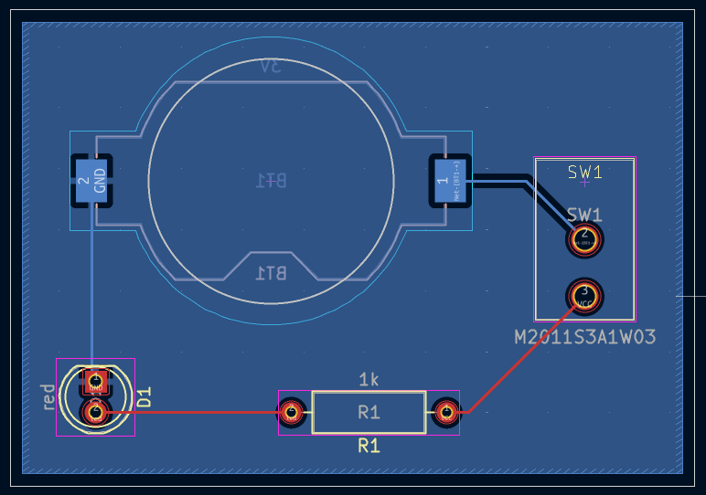

# 🎯 Symbol vs Footprint in KiCad

In this part, I worked on how to **create custom symbols and footprints** in KiCad, especially when a component I need is **not available in the default libraries**. I followed **Tutorial Part 4** from *Getting Started in KiCad*, using the switch **NKK M2011S3A1W03** as a practical example.

---

## 📚 How KiCad Libraries Work

- 🔧 **Symbols** (for schematics) and **footprints** (for PCB layout) are kept in **separate libraries**.
- KiCad uses **library tables** to locate and manage these libraries.
- There are **global tables** (used across all projects) and **project-specific tables**.
- Manage them from:
  - `Preferences` → `Manage Symbol Libraries…`
  - `Preferences` → `Manage Footprint Libraries…`
- Use `${KIPRJMOD}` to make paths relative to the project folder.
- 🧼 If something breaks, you can reset the tables (just back them up first!).

---

## 🗃️ Creating a New Library

Before creating a component, decide **where to store it**.

### 🧩 Steps:

1. Open the **Symbol Editor** or **Footprint Editor**.
2. Go to `File` → `New Library…`
3. Choose **Project** scope.
4. Name it clearly (e.g., `getting-started.kicad_sym` or `getting-started.pretty`).
5. Save it inside your project folder.

✅ The library will appear in the left panel and is ready to use.

---

## ✍️ Creating a Custom Symbol

Symbols are what we see in the **schematic**.

### 🔧 Steps:

1. Open the Symbol Editor and select your new library.
2. `File` → `New Symbol…`
3. Give it a name (e.g., `M2011S3A1W03`) and a reference prefix (`SW`).
4. Add pins using "Add pin" or `Insert`.
5. Set pin properties:
   - Name: `A`
   - Number: `2`
   - Electrical type: `Passive`
   - Orientation and position
6. Use a **50 mil grid** to ensure connections later.
7. Draw the symbol outline with lines or shapes.
8. Set symbol properties: value, keywords, visibility.
9. 💾 Save the symbol.

---

## 🧱 Creating a Custom Footprint

Footprints define the **physical layout** on the PCB.

### 🧰 Steps:

1. Open the Footprint Editor.
2. Create a new library if needed.
3. `File` → `New Footprint…`
4. Set name, value, and type (`Through-hole`, `SMD`, etc.).
5. Add pads:
   - Match pad numbers with symbol pins
   - Configure size, shape, and position
   - For through-hole: define **hole + pad size**
6. Use grid settings or custom alignment.
7. Add graphics on appropriate layers:
   - `F.Fab` → for technical details
   - `F.Silkscreen` → visible on the board
   - `F.Courtyard` → spacing and DRC
8. 💾 Save the footprint.

---

## 🔗 Linking Symbol ↔ Footprint ↔ 3D Model

Once both are done:

- In the symbol’s `Footprint` field, enter the footprint name.
- You can also set a **default footprint** during symbol creation.
- Use **footprint filters** to help with future assignments.
- In the Footprint Editor:
  - Go to `Properties → 3D Models`
  - Add `.step` or `.wrl` models and adjust rotation, scale, offset

🔧 Tools like **FreeCAD + StepUp** can help with 3D alignment.

---

## 🛠️ Final Integration

Once everything is ready:

1. Add your custom symbol in the schematic.
2. Press `F8` or go to `Tools → Update PCB from Schematic`.
3. Place the footprint on the board.
4. Route tracks and fill zones (`B`).
5. Run **DRC** to check your design.

---

## 🖼️ Final Result

Here’s how my board turned out with the custom symbol and footprint connected:

